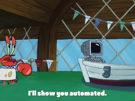
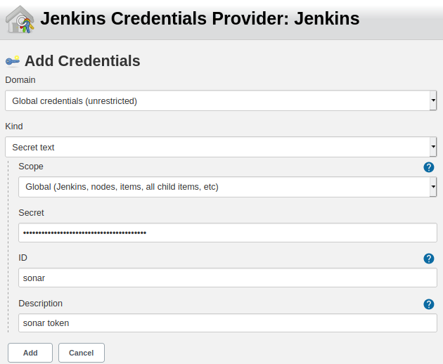
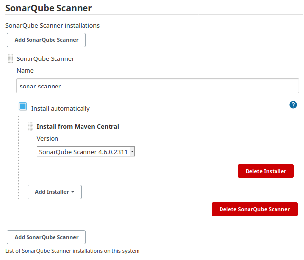
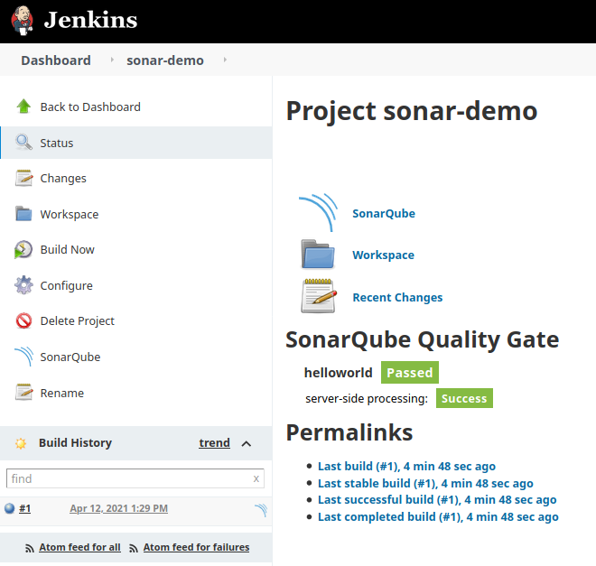
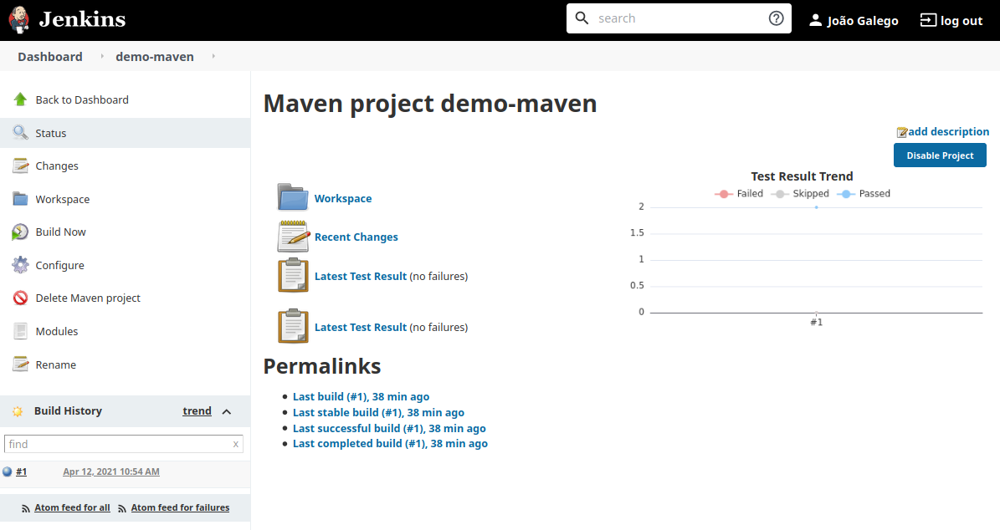
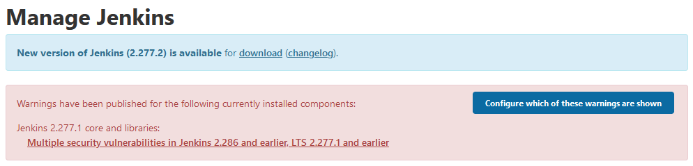
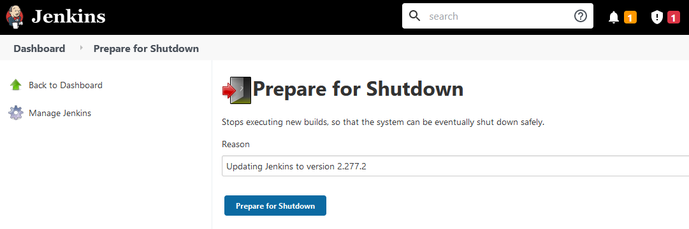
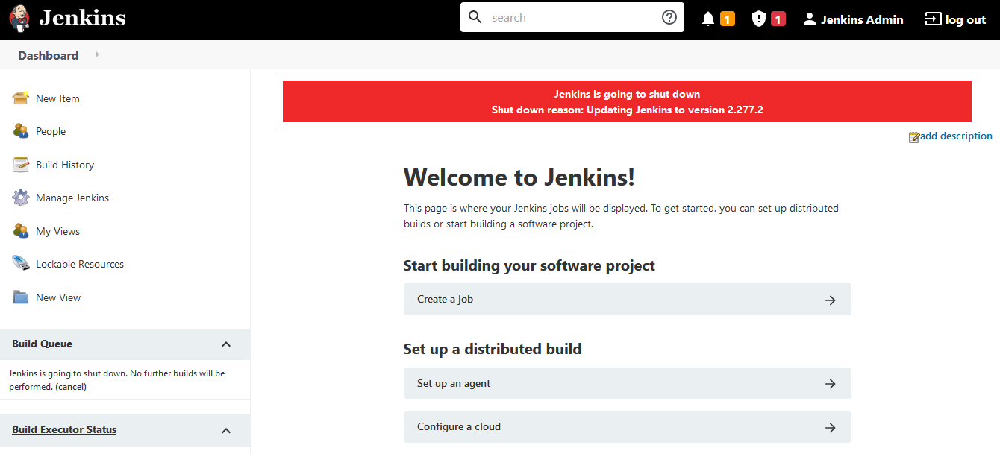
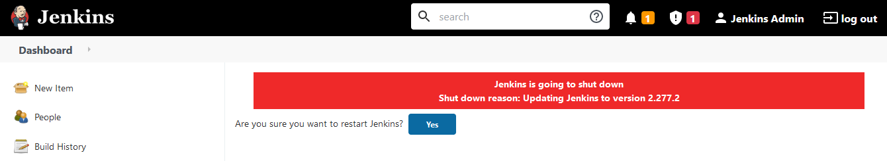

# Jenkins 101

## Overview

A short introduction to Jenkins, automation, CI/CD and DevOps



## Demos

> **Note:** Use [Docker](https://www.docker.com/) and [Docker Compose](https://docs.docker.com/compose/install/) (optional) to start a Jenkins server - don't install Jenkins directly on your machine if you don't have to

* [Hello World - `Freestyle`](https://www.guru99.com/create-builds-jenkins-freestyle-project.html)
* [Setting up Windows agents](https://wiki.jenkins.io/display/JENKINS/Step+by+step+guide+to+set+up+master+and+agent+machines+on+Windows)
* [Managing plugins](https://www.jenkins.io/doc/book/managing/plugins/)
    - [Green Balls](https://plugins.jenkins.io/greenballs/) 🟢
    - [AnsiColor](https://plugins.jenkins.io/ansicolor/)
    - [Build Monitor View](https://plugins.jenkins.io/build-monitor-plugin/)
    - [Jenkins Configuration as Code (JCasC)](https://www.jenkins.io/projects/jcasc/)
    - [Blue Ocean](https://www.jenkins.io/projects/blueocean/)
    - [and many more...](https://plugins.jenkins.io/)
* [Code review with Gerrit](https://plugins.jenkins.io/gerrit-trigger/)
    > For more information about Git and Gerrit, check out the [git - the simple guide](https://rogerdudler.github.io/git-guide/) and [Using Gerrit to enhance your Git](https://www.youtube.com/watch?v=Wxx8XndqZ7A) video from the Eclipse foundation.
    - Install [Git](https://git-scm.com/)
    - Open **Git Bash**
    - Configure user name and email
        ```
        git config --global user.email "<EMAIL>"
        git config --global user.name "<NAME>"
        ```
    - Run `ssh-keygen` leaving *every* input empty
        > **Note:** This should **never** be done in real systems
    - Run `cat ~/.ssh/id_rsa.pub` and save the input for later
    - Go to [`localhost:9090`](http://localhost:9090) and click **Skip Intro** to go to the Dashboard
    - Open **Settings ⚙️**
    - Go to **Profile** and change the **Full Name** to `<NAME>`
    - Go to **Email Addresses**, type `<EMAIL>` into **New email address** and click **Send Verification**
        > **Note:** In *developer* mode, Gerrit will skip this validation
    - Go to **SSH Keys**, paste the output of the `cat` command in the **New SSH Key** textbox and click **Add New SSH Key**
    - Go to **Browse > Repositories** and create a new repository by clicking **Create New**
        **Repository Name:** `<REPO_NAME>`
        **Owner:** `<NAME>`
        **Create initial empty commit**: `True`
        **Only serve as parent for other repositories**: `False`
    - Go back to the **Git Bash** window and clone the repository
        ```
        git clone "ssh://admin@localhost:29418/<REPO_NAME>" && scp -p -P 29418 admin@localhost:hooks/commit-msg "<REPO_NAME>/.git/hooks/"
        ```
    - Make a few changes and push everything to Gerrit
        ```
        cd <REPO_NAME>
        echo 'Hello World!' > README.md
        git add README.md
        git commit -m "Added README"
        git push origin HEAD:refs/for/master
        ```
* [Static analysis with SonarQube](https://docs.sonarqube.org/latest/analysis/scan/sonarscanner-for-jenkins/)
    - Go to [`localhost:9000`](http://localhost:9000) and log into SonarQube

        > When installing SonarQube, a default user with Administer System permission is created automatically (**Login:** `admin`, **Password:** `admin`) cf. [Instance Administration > Security](https://docs.sonarqube.org/latest/instance-administration/security/) for additional information
    - Go to [**My Account > Security**](http://localhost:9000/account/security/)
    - In **Tokens**, enter a token name and click **Generate** - copy the token so we can use it later
    - Go to **Plugin Manager** and install the [SonarQube Scanner](https://plugins.jenkins.io/sonar) plugin
    - Go to **Configure System > SonarQube Servers** and click **Add SonarQube**
        **Name:** `sonar`
        **Server URL:** `http://sonarqube:9000`
    - In **Server authentication token**, click **Add**, select **Jenkins** and add the sonar token cf. image below for more details
    
    - **Apply** and **Save**
    - Go to **Global Tools Configuration > SonarQube Scanner** and click **Add SonarQube Scanner**
    
    - **Apply** and **Save**
    - Create a new *Freestyle* job
    - In **Source Code Management**, select `Git` and set **Repository URL** e.g. `https://github.com/Coveros/helloworld`
    - In **Build**, click **Add build step** and select **Executre SonarQube Scanner**
    - Set **Tasks to run** to `-Dsonar.projectKey=helloworld`
    - **Apply** and **Save**
    - Trigger a new build by clicking **Build Now**
    
* [Unit tests with Maven](https://www.toolsqa.com/jenkins/jenkins-maven/)
    - Go to **Plugin Manager** and install the [Maven Integration](https://plugins.jenkins.io/maven-plugin/) plugin
    - Go to **Global Tools Configuration** and add a new **Maven installation**
    - Create a new **Maven project**
    - In **Source Code Management**, select `Git` and add the **Repository URL** e.g. https://github.com/jenkins-docs/simple-java-maven-app
    - In **Build**, set **Goals and options** to `clean install`
    - **Apply** and **Save**
    - Trigger a new build by clicking **Build Now**
    
* [UI automation with RobotFramework + Selenium](https://www.youtube.com/watch?v=AYTvoRaNjZ8)
    <!--
    Projects:
        + [Web testing with Robot Framework and Selenium Library](https://github.com/robotframework/WebDemo)
        + [Can you help on creating chrome options in RIDE](https://forum.robotframework.org/t/can-you-help-on-creating-chrome-options-in-ride/1093/2)
    -->
    - [Setting up your Jenkins machine to execute Robot Framework automation tests](https://faun.pub/setting-up-your-jenkins-machine-to-execute-robot-framework-automation-tests-a98b3e599119)
    - Install [Selenium](https://www.selenium.dev/) libraries and drivers
        ```
        pip3 install selenium robotframework-selenium2library robotframework-seleniumtestability webdrivermanager
        ```
    - **Warning:** Beware [ice-cream cones](https://alisterbscott.com/kb/testing-pyramids/) 🍦, [hourglasses](https://testing.googleblog.com/2020/11/fixing-test-hourglass.html) and other [test automation anti-patterns](https://medium.com/swlh/anti-patterns-of-automated-software-testing-b396283a4cb6)
* [Running Postman collections with Newman](https://learning.postman.com/docs/running-collections/using-newman-cli/integration-with-jenkins/)
    - Use [postmanlabs/newman](https://github.com/postmanlabs/newman)
        ```
        newman run examples\sample-collection.json --disable-unicode --reporter-junit-export results.xml --reporters cli,junit
        ```
* [Hello World - `Pipeline`](https://www.jenkins.io/doc/pipeline/tour/hello-world/)
* [Managing Jenkins with Script Console](https://www.jenkins.io/doc/book/managing/script-console/)
    - [List all jobs](https://support.cloudbees.com/hc/en-us/articles/226941767-Groovy-to-list-all-jobs)
    - [Scriptler](https://plugins.jenkins.io/scriptler/) and [Jenkins scripts](https://github.com/jenkinsci/jenkins-scripts)
* [LDAP authentication](https://plugins.jenkins.io/ldap/)
    > **Note:** use `docker-compose.prod.yml` to start an LDAP service and use [phpLDAPadmin](http://phpldapadmin.sourceforge.net/wiki/index.php/Main_Page) to create an organizational unit (OU) for `users`
    - Go to **Manage Jenkins > Security > Configure Global Security**
    - Scroll down to **Security Realm** and select `LDAP`
        **Server:** `ldap://ldap`
        **root DN:** `ou=users,dc=example,dc=org`
        **User search filter:** `uid={0}`
        **Manager DN:** `cn=admin,dc=example,dc=org`
        **Manager Password:** `secret`
        **Display Name LDAP attribute:** `cn`
        **Email Address LDAP attribute:** `mail`
    - **Test LDAP Settings** before saving
    - **Save** and **Apply**
* Updating Jenkins
    
    - Open a terminal inside master
        ```
        docker-compose exec -u root master bash
        ```
    - Replace `jenkins.war`
        ```
        cd /usr/share/jenkins
        wget https://updates.jenkins.io/download/war/<NEW_VERSION>/jenkins.war -O jenkins.war
        ```
    - [Prepare for shutdown](http://localhost:8080/prepareShutdown/), wait for all builds to stop and [restart](http://localhost:8080/restart) Jenkins

        
        
        

## References

### Links

- [Martin Fowler](https://www.martinfowler.com)'s website - check out the articles on [CI](https://www.martinfowler.com/articles/continuousIntegration.html), [CD](http://martinfowler.com/bliki/ContinuousDelivery.html) and [how to test microservice architectures](https://martinfowler.com/articles/microservice-testing/)
- (James Shore) [Continuous Integration on a Dollar a Day](https://www.jamesshore.com/v2/blog/2006/continuous-integration-on-a-dollar-a-day) - oldie but goodie, a funny introduction to CI
- (Google Cloud) [DevOps](https://cloud.google.com/devops) - Google Cloud's take on DevOps, read the chapter on [Continuous Testing](https://cloud.google.com/solutions/devops/devops-tech-test-automation)
- (Google) [SRE Books](https://sre.google/books/) - the Site Reliability Engineering (SRE) team at Google has published some interesting tomes on planetary-scale production Ops and how they've made automation a thing of beauty
- (GitHub) [atinfo/awesome-test-automation](https://github.com/atinfo/awesome-test-automation) - a curated list of test automation frameworks, tools and libraries
- (DevOps Cube) [Jenkins Architecture Explained – Beginners Guide](https://devopscube.com/jenkins-architecture-explained/) - concise introduction to Jenkins architectural components
- (Medium) [Top Jenkins Tutorials to Start in 2021 - Learn Jenkins online](https://medium.com/quick-code/top-tutorials-to-learn-jenkins-ci-for-testing-automation-93c7ac068f66) - check out one or two, and get your hands dirty

### Books

* **(Beyer *et al.*, 2016)** [Site Reliability Engineering: How Google Runs Production Systems](https://sre.google/workbook/table-of-contents/)
* **(Crispin & Gregory, 2014)** Agile Testing: A Practical Guide for Testers and Agile Teams
* **(Davis & Daniels, 2016)** Effective DevOps: Building a Culture of Collaboration, Affinity, and Tooling at Scale
* **(Forsgren, Humble & Kim, 2018)** Accelerate: Building and Scaling High Performing Technology Organizations
* **(Humble & Farley, 2010)** Continuous Delivery: Reliable Software Releases through Build, Test, and Deployment Automation
* **(Kim, Behr & Spafford, 2013)** The Phoenix Project: A Novel about IT, DevOps, and Helping Your Business Win
* **(Kim *et al.*, 2016)** The DevOps Handbook: How to Create World-Class Agility, Reliability & Security in Technology Organizations
* **(Kim, 2019)** The Unicorn Project: A Novel about Developers, Digital Disruption, and Thriving in the Age of Data
* **(Laster, 2018)** Jenkins 2 Up and Running: Evolve Your Deployment Pipeline for Next Generation Automation
* **(Leszko, 2017)** Continuous Delivery with Docker and Jenkins: Delivering software at scale
* **(Newman, 2015)** Building Microservices: Designing Fine-Grained Systems
* **(Smart, 2011)** Jenkins The Definitive Guide: Continuous Integration for the Masses
* **(Whittaker, Arbon & Carollo, 2012)** How Google Tests Software
* **(Winters, Manshreck & Wright, 2020)** Software Engineering at Google: Lessons Learned from Programming Over Time