# **Jenkins 101**

A short introduction to Jenkins, automation, CI/CD and DevOps

**João Galego**
https://jgalego.github.io

---

# **Who am I?**


## Academic Background

- ⚛️ MSc Physics
- 🕵️ PgD Forensic Studies
- 🧠 PhD Cognitive Science (ongoing)

## Professional Experience

- Data Analyst
- Test Automation Engineer
- DevOps Engineer
- ML Consultant

Currently, I work as a DevOps Engineer / ML Consultant at the [Siemens Lisbon Tech Hub](https://new.siemens.com/pt/en/company/jobs/jobs/lisbontechhub.html).

---

# **What is Jenkins?**

- Self-contained, open source, Java-based **automation** server

- History of Jenkins development in one line: `Hudson --> Jenkins 1.x --> Jenkins 2.x`

- Automates all sorts of tasks related to *building*, *testing*, and *delivering* or *deploying* software.

<div style="text-align:center">

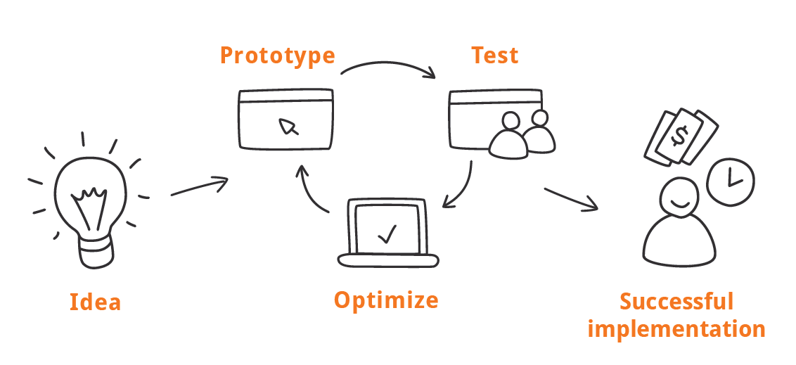

</div>

🤯 **Fun Fact:** In 2019, the EU edition of [DevOps World | Jenkins World](https://www.cloudbees.com/devops-world) was hosted in Lisbon

---

# **Automation 101**

## What is automation?

The use of software to create *repeatable* instructions and processes to *replace* or *reduce* human interaction with IT systems

**Use-Cases:**

- Ops teams use [infrastructure-as-code](https://en.wikipedia.org/wiki/Infrastructure_as_code) (IaC) tools like [Terraform](https://www.terraform.io/) to *reliably provision* entire infrastructures with a *single command*
- Sysadmins use tools like [Ansible](https://www.ansible.com/) or [Puppet](https://puppet.com/) to *configure* thousands of instances with no *manual intervention*
- SWE teams use tools like [Maven](https://maven.apache.org/) or [Bazel](https://bazel.build/) to *build* applications *faster*
- QA teams use [test automation frameworks and tools](https://github.com/atinfo/awesome-test-automation) to run all kinds of tests *multiple times*

**TL;DR** We can think of automation as both *meta-software* (software to act on software) and *force multiplier* (a helpful tool for understaffed and/or overworked teams)


---

# **Automation 101**

### Why automate?

[Eliminate **toil**](https://sre.google/sre-book/eliminating-toil/) i.e. work w/o productivity, and make life easier

⚠️ Mind the **automatic** / **automated** gap

### Automation and DevOps

*Automate everything* is a fundamental principle of DevOps and automation is the driving force behind the [3 Ways](https://itrevolution.com/the-three-ways-principles-underpinning-devops/) (flow, feedback, continuous learning and experimentation)

<div style="font-size:70%; text-align:center">

"Although automation may be seen as too expensive to implement (we often hear, ***I don’t have time or budget to automate—it’s not a feature!***) automation is truly a sound investment. It allows engineers to spend less time on manual work, thereby freeing up time to  spend on other important activities such as new development, refactoring, design work, and documentation. It also gives engineers more confidence in the toolchain, reducing stress in pushing changes." 

**Source:** [2019 Accelerate State of DevOps Report](https://cloud.google.com/devops/state-of-devops/)

</div>

📝 **Homework:** read [The Evolution of Automation at Google](https://sre.google/sre-book/automation-at-google/)

<!-- DORA State of DevOps 2019 - p. 60 -->


---

# **Jenkins**

## DevOps Hub

<div style="text-align: center">


</div>

---

# **Why Jenkins?**

## Features

Runs out-of-the-box, with packages for Windows, Mac OS X and other Unix-like operating systems

<div style="text-align:center">

  

</div>

Integrates with (practically) every tool in the [DevOps toolchain](https://en.wikipedia.org/wiki/DevOps_toolchain)

<div style="text-align:center">

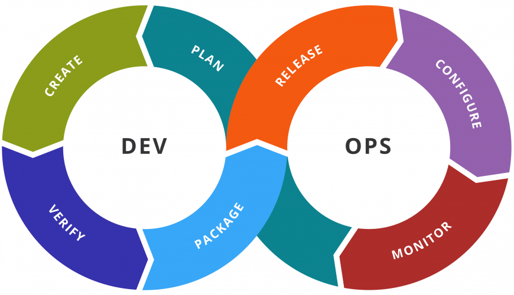

</div>

It can be extended via its [plugin](https://plugins.jenkins.io/) architecture, providing nearly infinite possibilities

---

# **Why Jenkins?**

## Alternatives

<div style="text-align:center">


</div>

---

# **Jenkins** 

## Architecture


**`Master`**
The central, coordinating process which stores configuration, loads plugins, and renders the UI for Jenkins

**`Slave` (1.x) / `Agent` (2.x)**
An agent is typically a machine, or container, which connects to a Jenkins master and executes tasks when directed by the master

**`Job` (1.x) / `Project` (2.x)**
A user-configured description of work which Jenkins should perform, e.g. building a piece of software

**`Build`**
The result of a single execution of a Project

---

# **CloudBees Jenkins Platform**

## Architecture

<div style="text-align:center">

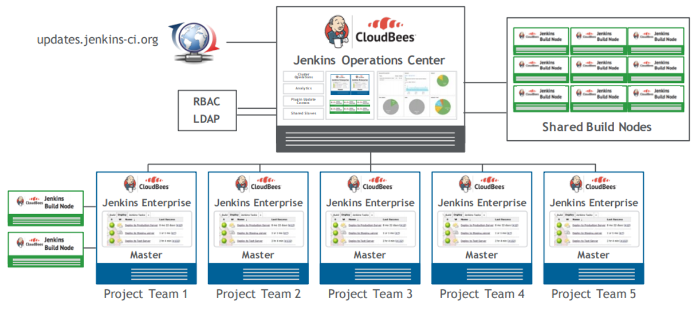

</div>

---

# **Jenkins Installation**

## Prerequisites

**Minimum HW requirements:**
- RAM: `256MB`
- Drive Space: `1GB`

**Recommended HW configuration (small team):**
- RAM: `4GB+`
- Drive Space: `50GB+`

**SW requirements:**
- [Java Requirements](https://jenkins.io/doc/administration/requirements/java)
- [Web Browser Compatibility](https://jenkins.io/doc/administration/requirements/web-browsers)
- [Windows Support Policy](https://www.jenkins.io/doc/administration/requirements/windows)

 

---

# **Jenkins Installation**

**Windows** 
[Run the installer](https://jenkins.io/download/) and follow the instructions

**MacOS** 
Use the [Homebrew](https://brew.sh/) package manager
- Latest release: `brew install jenkins`
- LTS version: `brew install jenkins-lts`

**Docker** 
Check the [Docker](https://www.jenkins.io/doc/book/installing/docker/) section of the [User Handbook > Installing Jenkins](https://jenkins.io/doc/book/installing/) documentation.
```
docker run --rm -p 8080:8080 jenkins/jenkins:lts
```

💡 **Tip:** When in doubt, install the [*Long-Term Support* (LTS)](https://www.jenkins.io/download/lts/) version

💡 **Tip:** By default, Jenkins uses port `8080` - this can be changed later by editing the `config.xml` file in the `JENKINS_HOME` directory.

<!-- For more information, visit [User Handbook > Installing Jenkins](https://jenkins.io/doc/book/installing/) -->

---


---


<!--
At this stage, if you skip the plugin installations, you’ll have to configure the HTTP proxy via the Plugin Manager. 

Only then will you be able to install the suggested plugins. 

Later in this course, we will show you how to do this.
-->

---


<!--
Mandatory: 
    + Server

Optional:
    + Port
    + Username
    + Password
    + No Proxy Host
-->

---

<div style="text-align:center">

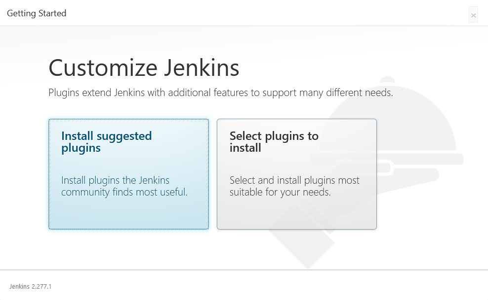

💡 **Tip:** In most cases, the *Install suggested plugins* option is the right choice

</div>

<!-- 
For most situations, the Install suggested plugins button is the best option.

However, there are at least two scenarios where the Select plugins to install option should be considered:

* You don’t want to install all the plugins in the suggested plugins list to keep things simple

* You want to install a different set of plugins that the ones listed in the suggested plugins
-->

---


---


---


---


---


---

# **Jenkins UI**

## Dashboard

<div style="text-align: center">

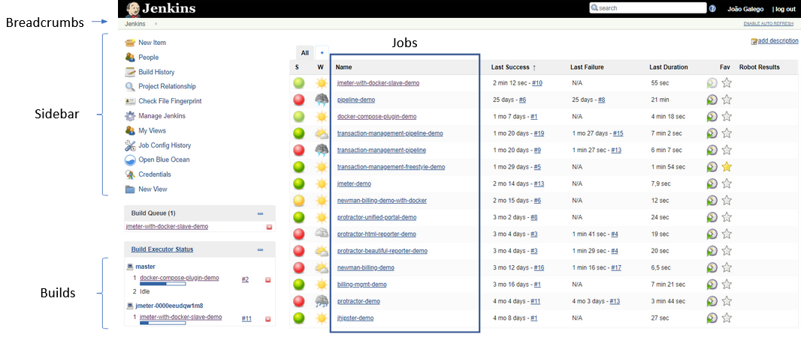

</div>

---

# **Jenkins UI**

## Job View

<div style="text-align: center">


</div>

---

# **Jenkins UI**

## Job Configuration View

<div style="text-align: center">


</div>

This is the `Configure` view for a simple **Freestyle** job. Other types of jobs e.g. **Pipeline** have a slightly different layout.

This is where you specify **what** the job will actually do and where you’ll probably spend most of your time.

---

# **Jenkins UI**

## Admin Console

<div style="text-align: center">

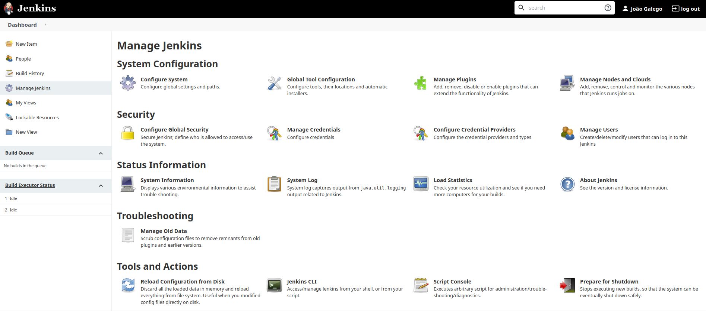

</div>

<!-- 💡 **Tip:** Eventually, you’ll start using the links directly instead of navigating to this menu e.g. navigating to `JENKINS_URL/configure` to open the **Configure System** page. -->

---

# **Managing Jenkins**

## `JENKINS_HOME` Directory

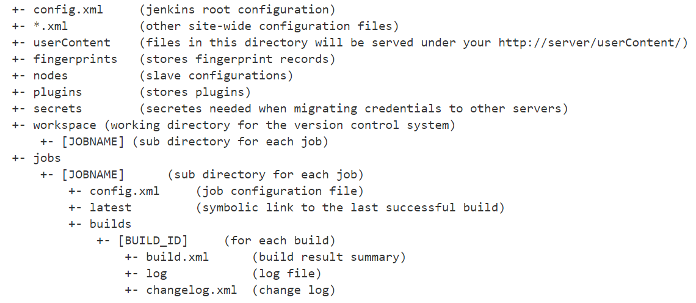

💡 **Tip:** For more information, visit [Administering Jenkins > JENKINS_HOME Directory](https://wiki.jenkins.io/display/JENKINS/Administering+Jenkins)

---

# **Managing Jenkins**

## Global Tool Configuration

<div style="text-align:center">


</div>

---

# **Managing Jenkins**

## System Log

<div style="text-align:center">


</div>

---

# **Project Types**

- For its simplicity, the **Freestyle** project is usually the best option. 

- Most project types in the Jenkins ecosystem are actually just extensions of the Freestyle project. If you don’t know what to create and/or want to keep your options open, use a Freestyle job. 

- If you already have some experience with Jenkins and/or developing software, consider using a **Pipeline**.

- Use the **Copy from** option at the bottom of the page if you know of a project with a similar configuration. This will save you a lot of trouble and a lot of time.

- This menu will vary depending on the plugins you have installed


---

# **Plugins**

## Introduction

Plugins are the primary means of enhancing a Jenkins master to suit organization- or user-specific needs.

Packaged as self-contained `.hpi` or `.jpi` files - which contain all the necessary code, images, and other resources that the plugin needs to operate successfully.

Plugins can be automatically downloaded (incl. their dependencies) from the [Update Center](https://jenkins.io/doc/book/glossary/#update-center).

<!-- 🎗️ Remember: The *Update Center* is a service operated by the Jenkins project which provides an inventory of open source plugins which have been developed and maintained by various members of the Jenkins community. -->

<div style="text-align:center">

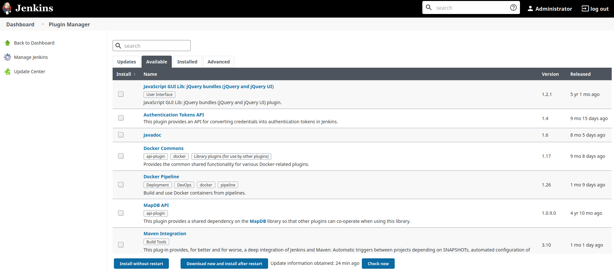

</div>

---

# **Plugins**

## Plugins Index

[There are over a thousand different plugins](https://plugins.jenkins.io/) which can be installed on a Jenkins master and integrate various build tools, cloud providers, analysis tools, and much more:

<div style="font-size:75%">

<!--
- [AnsiColor](https://plugins.jenkins.io/ansicolor/) - adds support for standard ANSI escape sequences, including color, to Console Output
- [Green Balls](https://plugins.jenkins.io/greenballs/) - changes Jenkins to use green balls instead of blue for successful builds
-->
- [JUnit](https://plugins.jenkins.io/junit/) - provides a publisher that consumes XML test reports generated during the builds and provides some graphical visualization of the historical test results
- [Robot Framework](https://plugins.jenkins.io/robot/) - collects and publishes [Robot Framework](http://robotframework.org/) test results
- [SonarQube Scanner](https://plugins.jenkins.io/sonar/) - allows easy integration of [SonarQube](http://www.sonarsource.org/), the open source platform for Continuous Inspection of code quality
- [Jenkins Configuration as Code (JCasC)](https://www.jenkins.io/projects/jcasc/) - reproduce and/or restore a full environment based on recipes and automation
- [Blue Ocean](https://www.jenkins.io/projects/blueocean/) - graphically create, visualize and diagnose Jenkins pipelines
- &c.

</div>

For more information, go to [Plugins Index](https://plugins.jenkins.io/)


<!--div style="text-align:center">


</div-->

---

# **Plugin Manager**

## HTTP Proxy Configuration

Go to `Manage Jenkins > Plugin Manager` and open the `Advanced` tab.

<div style="text-align:center">


</div>

---

# **Plugin Manager**

## Install Plugins (Automatic)

Go to `Manage Jenkins > Plugin Manager` and open the `Available` tab. 

Select the plugins you want to install and click `Install without restart` or `Download now and install after restart`.

<div style="text-align:center">


</div>

---

# **Plugin Manager**

## Install Plugins (Manual)

Download the `HPI/JPI` file, go to `Manage Jenkins > Plugin Manager` and open the `Advanced` tab.

In the `Upload Plugin` section, choose the `HPI/JPI` file and click `Upload`.

<div style="text-align:center">


</div>

---

# **Plugin Manager**

## Install Plugins

Most plugins will only be activated after a restart. The easiest way to do this is to check the `Restart Jenkins when installation is complete and no jobs are running` option at the bottom of the page.

<div style="text-align:center">

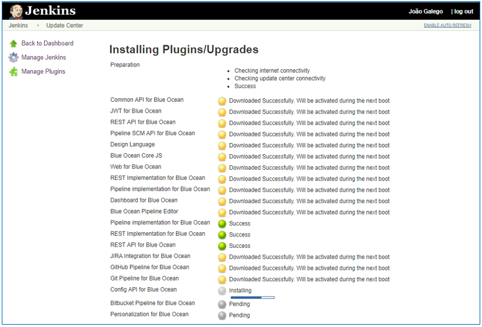

</div>

---

# **Plugin Manager**

## Update Plugins

Go to `Manage Jenkins > Plugin Manager` and open the `Updates` tab.

Select the plugins you want to update and click `Download now and install after restart`.

💡 **Tip:** There is no difference between installing a plugin and updating one. In both cases, Jenkins is essentially placing the newest version of an HPI/JPI file inside the plugins directory.

<div style="text-align:center">

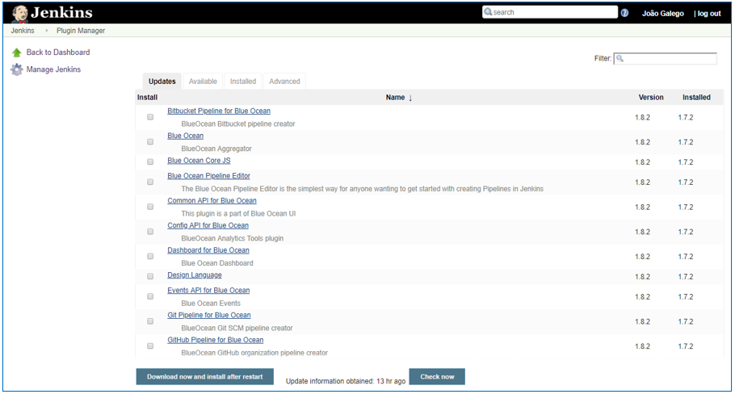

</div>

---

# **Plugin Manager**

## Remove Plugins

Go to `Manage Jenkins > Plugin Manager` and open the `Installed` tab. 

Click the `uninstall` button for the plugins you want to remove.

<div style="text-align:center">

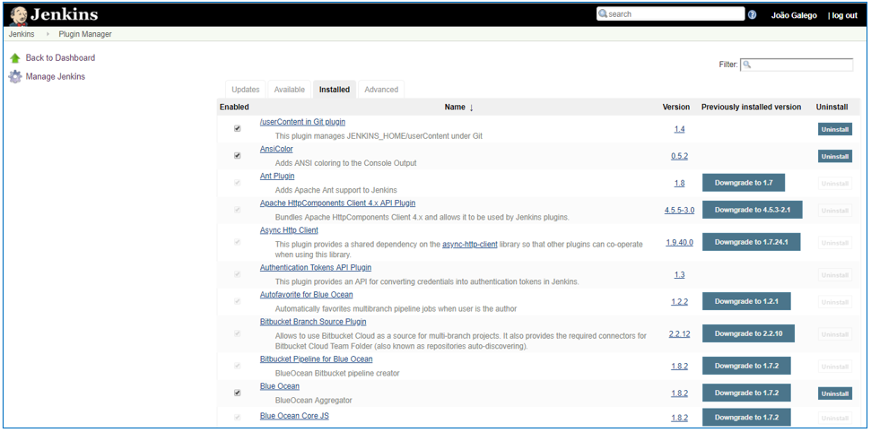

</div>

---

# **Pipelines**

### Why Pipelines?

<!--🎗️ CD Pipeline:** automated expression of your process for getting software from version control right through to your users and customers -->

- A way of automating the process of getting applications from [version control](https://en.wikipedia.org/wiki/Version_control) to the end users

- [**Pipeline syntax:**](https://www.jenkins.io/doc/book/pipeline/syntax/) `Declarative` (*preferred*) or `Scripted` - both use DSLs inspired by [Groovy](https://groovy-lang.org/)

<!-- The Declarative Pipeline syntax is usually the best choice since it a) provides richer syntactical features, and b) is designed to make writing and reading Pipeline code easier. -->

- [**Pipeline-as-code paradigm**](https://www.jenkins.io/doc/book/pipeline-as-code/): The **pipeline definition** is usually written into a text file called `Jenkinsfile` and committed into the project's repo - similar to [`.gitlab-ci.yml`](https://docs.gitlab.com/ee/ci/) (GitLab), [`azure-pipelines.yml`](https://docs.microsoft.com/en-us/azure/devops/pipelines/?view=azure-devops) (Azure DevOps), [`.travis.yml`](https://docs.travis-ci.com/user/customizing-the-build) (Travis) and [GitHub Actions](https://github.com/features/actions)

<!-- For more information about Pipelines, please visit [User Handbook > Pipeline](https://www.jenkins.io/doc/book/pipeline/) -->

### Properties

1. **Code:** implemented in code and typically checked into source control <!-- This gives teams the ability to edit, review, and iterate upon their delivery pipeline. -->

2. **Durable:** survive both *planned* and *unplanned* restarts of the Jenkins master

3. **Pausable:** can be stopped and wait for human input or approval before continuing

4. **Versatile:** support complex real-world CD requirements <!-- including but not limited to the ability to fork/join, loop, and perform work in parallel. -->

5. **Extensible:** supports custom extensions to its DSL and multiple options for integration with other plugins

---

# **Pipelines**

## Overview


---

# **Pipelines**

## Terminology

**`Pipeline`**
User-defined model of a CD pipeline

**`Node`**
A node is a machine which is part of the Jenkins environment and is capable of executing a Pipeline

**`Stage`**
*Conceptually* distinct subset of tasks performed through the entire Pipeline e.g. *Build*, *Test* and *Deploy* stages), which is used by many plugins to visualize or present Jenkins Pipeline status/progress

**`Step`**
A single task. Fundamentally, a step tells Jenkins *what* to do at a particular point in time.

💡 **Tip:** For more definitions, head over to the Jenkins [Glossary](https://www.jenkins.io/doc/book/glossary)

---

# **Declarative Pipeline**

<div style="font-size:65%">

- `pipeline` - contains the entire Jenkins Pipeline definition
- `agent` - defines the agent used for the entire Pipeline or a stage
    - `label` - existing Jenkins node label
    - `docker` - requires Docker-enabled node
        - `image` - run inside specified Docker image
        - `label` - existing Jenkins node label
        - `args` - arguments for Docker container
    - `dockerfile` - use a local Dockerfile
        - `filename` - name of local Dockerfile
        - `label` - existing Jenkins node label
        - `args` - arguments for Docker container
- `stages` - contains Pipeline stages and steps
    - `stage` - a specific named "stage" of the Pipeline
        - `steps` - one or more build steps that define the actions in the stage. 
        Contains one or more of the following:
            - any build step or build wrapper defined in Pipeline
 e.g. `sh`, `bat`, `timeout`, `echo`, `archive`, `junit`, etc.
            - `parallel` (optional) - execute steps in parallel - may not be used with other steps
            - `script` (optional) - execute *Scripted Pipeline* block
    - `when` (optional) - Runs stage conditionally
        - `branch` - stage runs when branch name matches
        - `expression` - boolean expression
    - `agent`, `environment`, `tools` and `post` may also optionally be defined in stage

</div>


---

# **Meet the Future**

## Jenkins X

CI/CD solution for modern cloud applications on [Kubernetes](https://kubernetes.io/)

<div style="text-align:center">


</div>

For more information, please visit [Jenkins X](https://jenkins-x.io/)

---

<div style="text-align:center">


## Jenkins is in berserk mode!

*What should I do?*

</div>

---

# **Common Challenges**

<div style="text-align:center">

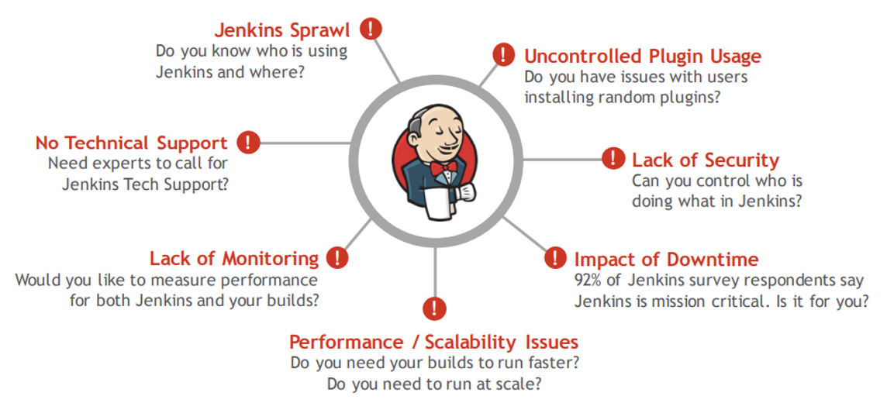

</div>

<!-- 
Adapted from https://www.slideshare.net/dcjuengst/cloudbeesjenkinsplatform2016
-->

---

# **Common Problems**

## Creating backups

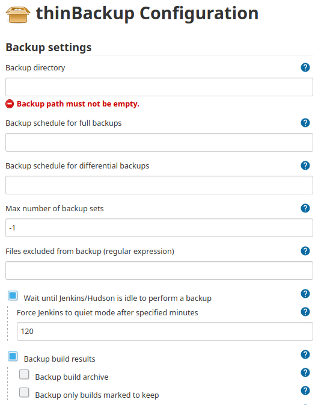

Install the [ThinBackup](https://wiki.jenkins.io/display/JENKINS/thinBackup) plugin and go to **Manage Jenkins > ThinBackup**.

<div style="text-align:center">


</div>

In the **Settings** page, set the backup directory and select the files you wish to keep.

Click the **Backup Now** button.

💡 **Tip:** Manual Jenkins updates can be performed by copying the contents of the backup folder to a clean Jenkins installation.

---

# **Common Problems**

## How do I start/stop/restart Jenkins manually?

To restart Jenkins *manually*, use one of the following commands:

`JENKINS_URL/safeRestart`

Allows all running jobs to complete. New jobs will remain in the queue to run after the restart is complete.

`JENKINS_URL/restart`

Forces a restart w/o waiting for builds to complete.

Whenever possible, use the **Manage Jenkins > Prepare for Shutdown** option:

<div style="text-align:center">

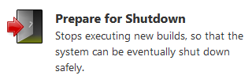

</div>

---

# **Common Problems**

## How do I start/stop/restart Jenkins manually?

**Windows** 
Open a command line with administrator privileges, cd to `JENKINS_HOME` and run `jenkins.exe start/stop/restart`.

**MacOS** 
Open a terminal window and type one of the following commands:
- Stop Jenkins: `sudo launchctl unload /Library/LaunchDaemons/org.jenkins-ci.plist`
- Start Jenkins: `sudo launchctl load /Library/LaunchDaemons/org.jenkins-ci.plist`

**Linux**

Open a new terminal window and run
`sudo service jenkins start/stop/restart`

---

# **Common Problems**

## What should I do when I find a problem with Jenkins?


**Make sure it’s actually a problem** 
99% of the time the problem lies with the configuration itself and not Jenkins. In most cases, a google search will return the solution.

**Collect Evidence**
Isolate the problem and go to **System Logs**

**Report the Issue**
Go to [issues.jenkins.io](https://issues.jenkins.io/) and open a ticket

---

# **Take-Home Messages**

- **Work *with* Jenkins, not *for* Jenkins** - if you're spending most of your time tweaking Jenkins settings and debugging problems, then you're doing it *wrong*

- **Automate Jenkins management** - use the [remote access API](https://www.jenkins.io/doc/book/using/remote-access-api/), [script console](https://www.jenkins.io/doc/book/managing/script-console/), [JCasC](https://www.jenkins.io/projects/jcasc/) and other features and plugins, to perform basic Jenkins operations

- **Love thy Pipelines** - *Freestyle* jobs are a thing of the past, use *Pipelines* whenever possible and take good care of them - writing pipelines is more art, than science

- **Cattle vs Pets** - leverage the power of [Docker](https://www.docker.com/) and use ephemeral agents cf. [Using Docker with Pipeline](https://www.jenkins.io/doc/book/pipeline/docker/) for more information

- **Don't go blaming Jenkins if you write "bad" tests** - it's not Jenkins' fault if you write *brittle* and/or *flaky* tests cf. [all your tests are terrible](https://www.youtube.com/watch?v=u5senBJUkPc)

- **Learn [effective troubleshooting](https://sre.google/sre-book/effective-troubleshooting/) and RTFM** - investigate why a system doesn't work and dig deep into [Jenkins documentation](https://www.jenkins.io/doc/book/) and [StackOverflow](https://stackoverflow.com/questions/tagged/jenkins) to find a solution

---

## **References**

### Books
<div style="text-align: center">
    <div class="row">
    <div class="column" style="height:400px; padding:20px">
        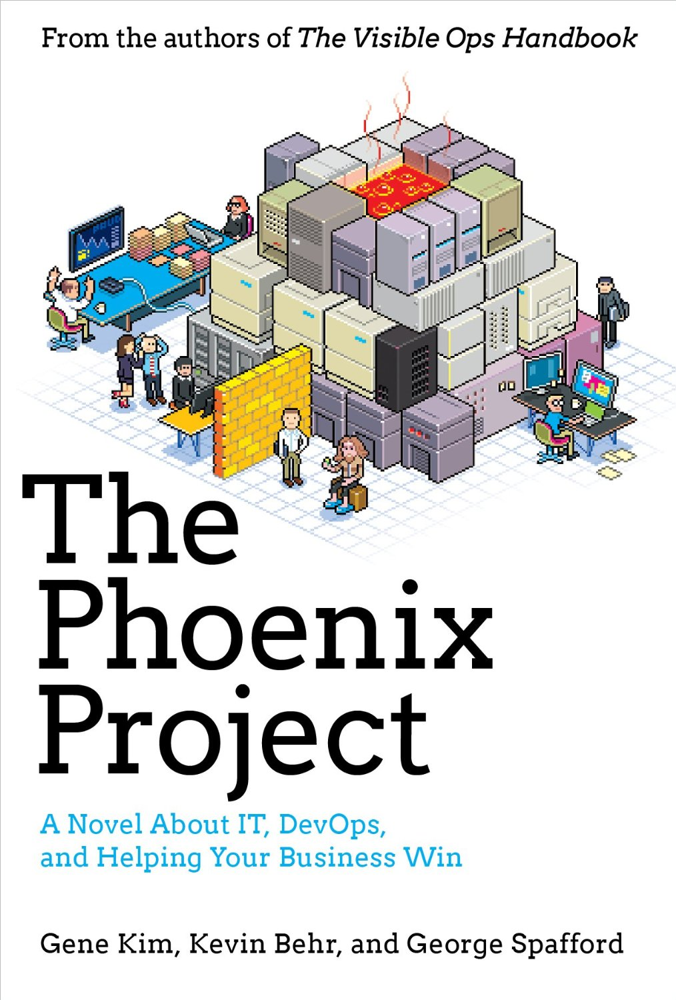
        
        
        
    </div>
    <div class="column" style="height:400px; padding:20px">
        
        
        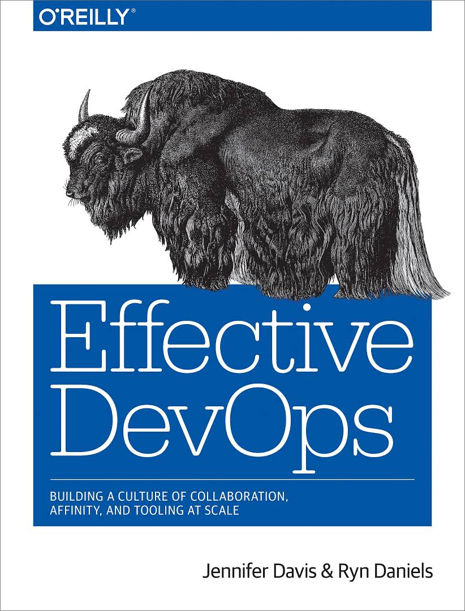
        
    </div>
    </div>
</div>

---

## **References**

### General

- [Martin Fowler](https://www.martinfowler.com) - check out the articles on [CI](https://www.martinfowler.com/articles/continuousIntegration.html), [CD](http://martinfowler.com/bliki/ContinuousDelivery.html) and [how to test microservice architectures](https://martinfowler.com/articles/microservice-testing/)
- (James Shore) [Continuous Integration on a Dollar a Day](https://www.jamesshore.com/v2/blog/2006/continuous-integration-on-a-dollar-a-day) - oldie but goodie, a funny introduction to CI
- (Google Cloud) [DevOps](https://cloud.google.com/devops) - Google Cloud's take on DevOps, read the chapter on [Continuous Testing](https://cloud.google.com/solutions/devops/devops-tech-test-automation)
- (Google) [SRE Books](https://sre.google/books/) - the Site Reliability Engineering (SRE) team at Google has published some interesting tomes on planetary-scale production Ops and how they've made automation a thing of beauty
- (GitHub) [atinfo/awesome-test-automation](https://github.com/atinfo/awesome-test-automation) - a curated list of test automation frameworks, tools and libraries
- (DevOps Cube) [Jenkins Architecture Explained – Beginners Guide](https://devopscube.com/jenkins-architecture-explained/) - concise introduction to Jenkins architectural components
- (Medium) [Top Jenkins Tutorials to Start in 2021 - Learn Jenkins online](https://medium.com/quick-code/top-tutorials-to-learn-jenkins-ci-for-testing-automation-93c7ac068f66) - check out one or two, and get your hands dirty
